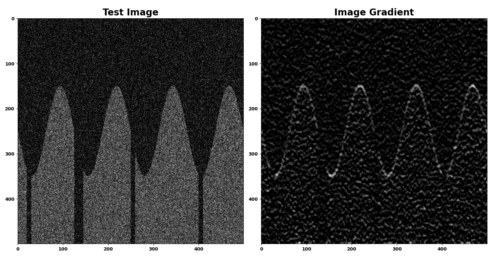
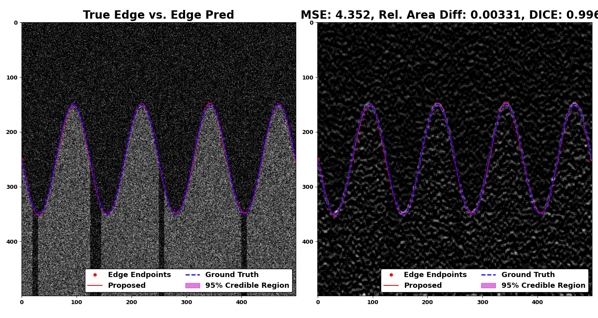

# Edge Tracing using Gaussian Process Regression

Repository storing python module which implements a framework to trace individual edges in an image using Gaussian process regression.


---

## Abstract from [paper](https://arxiv.org/abs/2111.03605) on methodology

We introduce a novel edge tracing algorithm using Gaussian process regression. Our edge-based segmentation algorithm models an edge of interest using Gaussian process regression and iteratively searches the image for edge pixels in a recursive Bayesian scheme. This procedure combines local edge information from the image gradient and global structural information from posterior curves, sampled from the model's posterior predictive distribution, to sequentially build and refine an observation set of edge pixels. This accumulation of pixels converges the distribution to the edge of interest. Hyperparameters can be tuned by the user at initialisation and optimised given the refined observation set. This tunable approach does not require any prior training and is not restricted to any particular type of imaging domain. Due to the model's uncertainty quantification, the algorithm is robust to artefacts and occlusions which degrade the quality and continuity of edges in images. Our approach also has the ability to efficiently trace edges in image sequences by using previous-image edge traces as a priori information for consecutive images. Various applications to medical imaging and satellite imaging are used to validate the technique and comparisons are made with two commonly used edge tracing algorithms.

### More information

Paper which describes this methodology has been accepted to be published in IEEE Transactions on Image Processing in December 2021 or January 2022 (TBC).

For open access to this paper for information on the algorithm, pseudocode, applications and discussion, see [here](https://arxiv.org/abs/2111.03605)


---

## Getting started

### Required packages

* `numpy`
* `matplotlib`
* `scikit-learn`
* `scitkit-image`
* `KDEpy`
* `scipy`
* `time`

### Code demonstration

After cloning this repository, import the [python module](gp_edge_tracing/) and the provided [utilities](gp_edge_tracing/gpet_utils.py) script:

```
# Import relevant python packages
import numpy as np
from gp_edge_tracing import gpet_utils, gpet
```

We can now construct the same noisy, test image used in the [paper](https://arxiv.org/abs/2111.03605):

```
# Create test image with single sinusoidal edge and simple image gradient
N = 500
test_img, true_edge = gpet_utils.construct_test_img(size=(N,N), amplitude=200, curvature=4, noise_level=0.05, ltype='sinusoidal', intensity=0.3, gaps=True)

kernel = gpet_utils.kernel_builder(size=(11,5), unit=False)
grad_img = gpet_utils.comp_grad_img(test_img, kernel)
```

This test image and corresponding image gradient is shown below.



With specification of default parameters we can run the edge tracing algorithm:

```
# Define model parameters
kernel_params = {'kernel': 'RBF', 'sigma_f': 75, 'length_scale': 20}
delta_x = 5
score_thresh = 1
N_samples = 1000
noise_y = 1
seed = 1
keep_ratio = 0.1
init = true_edge[[0, -1],:][:, [1,0]]
obs = np.array([])
fix_endpoints=True
return_std = True

# Instantiate algorithm using parameters in __init__()
noisy_trace = gpet.GP_Edge_Tracing(init, grad_img, kernel_params, noise_y, obs, N_samples, score_thresh,
                                   delta_x, keep_ratio, seed, return_std, fix_endpoints)

# __call__() parameters and run algorithm on test image
# Change these verbosity parameters to monitor fitting procedure
print_final_diagnostics = False
show_init_post = False
show_post_iter = False
verbose = False
edge_pred, edge_credint = noisy_trace(print_final_diagnostics, show_init_post, show_post_iter, verbose)
```

We can then superimpose the edge prediction and 95% credible interval onto the test image and image gradient, quantitatively comparing the prediction with the ground truth, as shown below.



### More information 

please refer to this [notebook](gpet_demo.ipynb) for the code to reproduce this result, as well as where to find more information on the compulsory, tuning and verbosity parameters.

---
## Contributors

* Jamie Burke (Jamie.Burke@ed.ac.uk)

